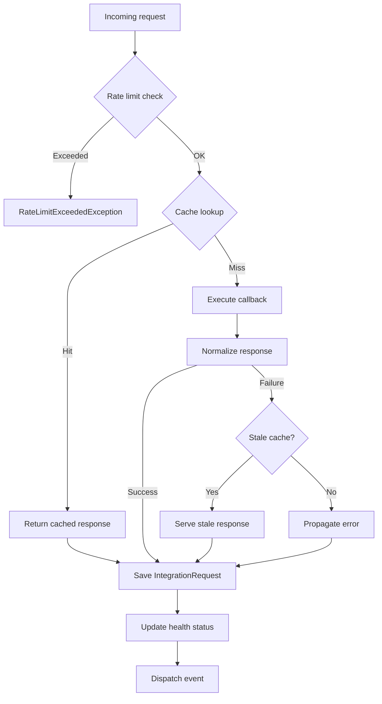

# Making requests

Requests run through a fluent builder rooted at `at($endpoint)`. The builder wraps your API call with logging, caching, rate limiting, retries, and health tracking.

## The fluent builder

Start with `at($endpoint)`, chain `->as(SomeData::class)` if you want a typed response, optionally chain modifiers (`withCache`, `withAttempts`, `withData`, `relatedTo`, `retryOf`), then call the verb that runs the request: `->get()`, `->post()`, `->put()`, `->patch()`, `->delete()`, or the generic `->execute($method, $callback)`.

### Typed responses

`->as()` requires a [Spatie Laravel Data](https://spatie.be/docs/laravel-data/v4/introduction) class-string. The response is reconstructed via `Data::from()`, so you get a typed object on every call (live and cached):

```php
$issues = $integration
    ->at('/repos/{owner}/{repo}/issues')
    ->as(IssueListResponse::class)
    ->withCache(3600, serveStale: true)
    ->withAttempts(3)
    ->relatedTo($issue)
    ->get(fn () => Http::get($url));
```

### Untyped responses

Skip `->as()` for non-JSON responses (PDFs, HTML, binary data) or any case where you don't need a typed object back. The terminal verb returns `mixed`:

```php
$pdf = $integration
    ->at('/api/invoice.pdf')
    ->get(fn () => Http::get($url));
```

If you cache an untyped response and the response is an object, a warning is logged suggesting you add `->as(SomeData::class)`.

### URL shortcut

Untyped terminal verbs accept a URL string instead of a closure. The builder uses Laravel's HTTP client to make the call. An array `withData()` becomes a query string on `GET` and a JSON body on other methods; a string `withData()` is sent as the raw body on non-`GET` requests:

```php
$response = $integration
    ->at('/repos/{owner}/{repo}/issues')
    ->withData(['state' => 'open'])
    ->get('https://api.github.com/repos/acme/widgets/issues');
```

This shortcut is only available on the untyped builder. Typed callers (after `->as(...)`) always pass a closure, since they're typically wrapping an SDK call.

The `endpoint` argument passed to `at()` is a logical identifier. It can be a real HTTP path or an SDK operation name; the value is used for logging, caching, rate-limit bucketing, and matching in the request-fake/assertion layer.

```php
// SDK-style: the endpoint name is purely a label
$issue = $integration
    ->at('issues.create')
    ->as(IssueResponse::class)
    ->withData(['title' => $title])
    ->post(fn () => $github->issues()->create($owner, $repo, ['title' => $title]));
```

### Builder methods

| Method | Description |
|--------|-------------|
| `as(class-string<Data> $class)` | Type the response (return Data instance from terminal verb) |
| `withCache(int\|CarbonInterface $ttl, bool $serveStale)` | Cache successful responses |
| `withAttempts(int $max)` | Set max retry attempts |
| `relatedTo(Model $model)` | Link request to a model |
| `withData(string\|array $data)` | Attach request data for logging (and as query/body when using the URL shortcut) |
| `retryOf(int $id)` | Mark as retry of a previous request |

## Direct `request()` for unusual cases

The fluent builder calls into a lower-level `Integration::request()` method directly. Most code should use the builder, but `request()` is exposed when you have a method/callback in hand and don't want to build the chain:

```php
$issue = $integration->request(
    endpoint: 'issues.create',
    method: 'POST',
    callback: fn () => $github->issues()->create($owner, $repo, ['title' => $title]),
    responseClass: IssueResponse::class, // optional
    requestData: ['title' => $title],
    cacheFor: now()->addHour(),
    serveStale: true,
    maxAttempts: 3,
);
```

## What happens inside a request

<InlineSvg src="/request-pipeline.svg" />

<details>
<summary>Mermaid source</summary>



</details>
